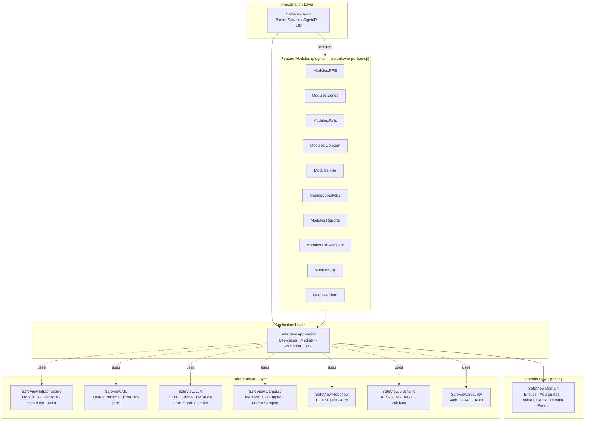
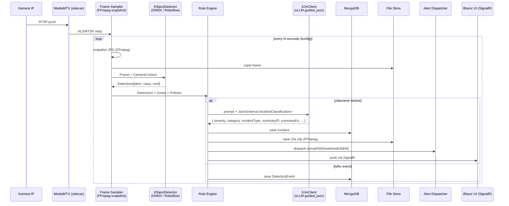
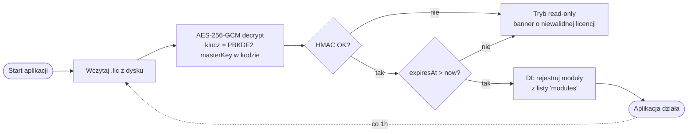
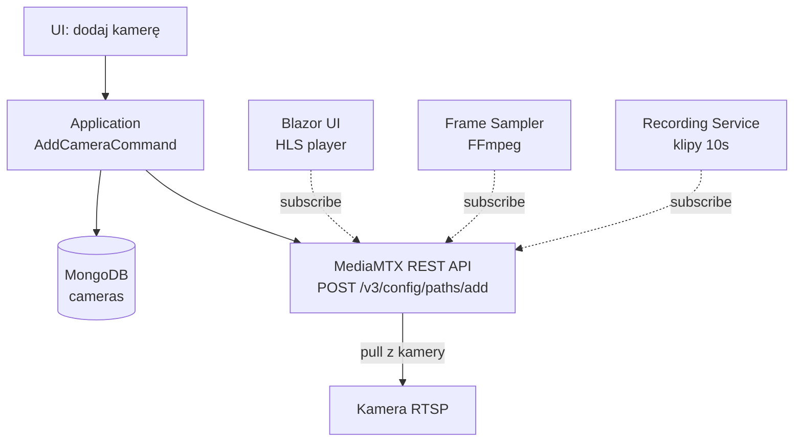
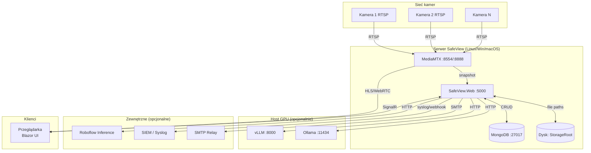

# SafeView — Architektura systemu

> **Wersja:** 0.1
> **Data:** 2026-04-14
> **Powiązane:** `PLAN_PRAC.md` (v0.2)

---

## 1. Warstwy (Clean Architecture)



**Kierunek zależności:** wszystko wskazuje na Domain (Domain nic nie importuje). Infrastructure i Application implementują interfejsy zdefiniowane w Domain/Application.

---

## 2. Pipeline detekcji zdarzenia (runtime)



**Kluczowe:** LLM dostaje już odfiltrowane zdarzenia (Rule Engine robi pre-filtracja), nie wszystkie klatki. Structured output vLLM zwraca deterministyczny JSON, który bezpośrednio trafia do kolekcji `incidents`.

---

## 3. Flow licencji



**Bezpieczeństwo:** masterKey jest "zaszyty" w kodzie (obfuskowany, składany z fragmentów) — to bariera przeciwko *casual tamperingowi*, nie przeciwko reverse-engineeringowi. Prawdziwa ochrona = prawny kontrakt + HMAC (klient nie może sam wygenerować licencji bez masterKey).

---

## 4. Konfiguracja MediaMTX



**Zysk:** kamera obsługuje *jedno* połączenie (MediaMTX pull), trzech konsumentów (UI, ML, recording) nie obciąża jej wielokrotnie.

---

## 5. Moduł licencjonowany — model pluginu

Każdy feature module to osobny assembly z klasą `IFeatureModule`:

```csharp
public interface IFeatureModule {
    string Code { get; }                          // np. "MOD.PPE"
    string NameKey { get; }                       // klucz i18n
    void RegisterServices(IServiceCollection s);  // wszystko co moduł potrzebuje
    void RegisterRoutes(IEndpointRouteBuilder e); // opcjonalne endpointy
    IEnumerable<NavItem> GetNavigation();         // pozycje menu
}
```

W `Program.cs` (rejestracja warunkowa):
```csharp
var license = await licenseService.LoadAsync();
foreach (var module in discoveredModules) {
    if (license.IsModuleEnabled(module.Code)) {
        module.RegisterServices(builder.Services);
    }
}
```

---

## 6. Struktura katalogów na dysku (konfigurowalne)

```
{StorageRoot}/
├── frames/{yyyy}/{MM}/{dd}/{cameraId}/{HHmmss}_{eventId}.jpg
├── clips/{yyyy}/{MM}/{dd}/{cameraId}/{HHmmss}_{incidentId}.mp4
├── reports/{yyyy}/{MM}/{reportId}.pdf
├── models/{modelId}/{version}.onnx
└── uploads/{userId}/{yyyy-MM}/{filename}
```

Wszystkie 5 ścieżek to osobne `IOptions<StoragePaths>` — admin może skierować `clips/` na szybszy dysk SSD, `reports/` na wolniejszy, itd.

---

## 7. Diagram komponentów — widok wdrożenia



---

## 8. Podsumowanie kluczowych decyzji technicznych

| Decyzja | Uzasadnienie |
|---|---|
| Blazor Server (nie WASM) | SignalR out-of-the-box, łatwy dostęp do lokalnych zasobów (ONNX, FFmpeg), brak problemów CORS/auth, prostsze debugowanie |
| MongoDB (nie SQL) | Schema-flexible (eventy detekcji mają różne struktury), łatwe skalowanie, dobra biblioteka `MongoDB.Driver` |
| MediaMTX (nie bezpośrednie RTSP) | Multiplexing strumieni, niezależność od kamer, łatwe udostępnienie HLS/WebRTC do przeglądarki |
| vLLM + guided_json | Deterministyczne structured outputs bez post-processingu, wysoka wydajność na GPU |
| Pluginy per-licencja | Klient płaci za to co używa; kod modułów niewczytywany jeśli wyłączony (DI + assembly scan) |
| Pliki na dysku, nie w DB | MongoDB to nie storage dla MB/GB plików; ścieżki + indeksy w DB, pliki na lokalnym/sieciowym FS |
